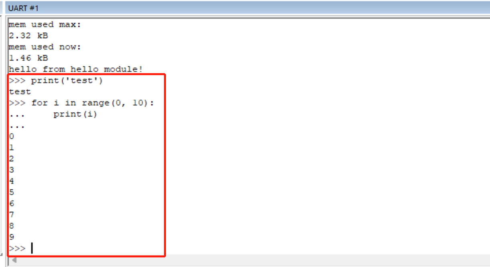

# How to Get Started with PikaScript using KEIL Simulator

In this article, we introduce a way of playing PikaScript without any hardware, i.e. using simulation in MDK. 
The target board of simulation is stm32f103, and you can experience the fun of pikascript immediately after downloading the project.

## Create project
Enter pikascript official website [http://pikascript.com](http://pikascript.com)

Select simulation-keil and click "Start Generation"


Unzip the downloaded zip archive and open the project


### Run the simulation project
Make sure you have select the simulator as the debugging target


Compile and debug:


Once entering the debug session, make sure you have opened the serial windows as shown below:


run and check the output:


## REPL

Python scripts can be run interactively by typing them directly into the UART window.

With **4 spaces** for indentation.



## How to Change a different python script

Open main.py in any editor, e.g. vscode:


In main.py, you might see something similar:

````python
# main.py
from PikaObj import *
import Device
import PikaStdLib

led = Device.LED()
uart = Device.Uart()
mem = PikaStdLib.MemChecker()

print('hello wrold')
uart.setName('com1')
uart.send('My name is:')
uart.printName()
print('mem used max:')
mem.max()
print('mem used now:')
mem.now()
````

This script uses standard python3 syntax. Suppose we have updated this script, so how to make it run in the microcontroller?

The interesting part is, pikascript uses a method similar to java, i.e. it is semi-compiled and semi-interpreted. For example, classes and methods are to be compiled, while method-calls and object-creation/destruction are to be interpreted at runtime. .

The pikascript compilation is a two-step process:
1. Use the pikascript precompiler to compile the .py files into .c and .h files in pikascript-api.
2. Use the c compiler to compile all the c source files, and then download the generated image into the microcontroller.

Double-click `rust-msc-vxx.yy.zz.exe` to run the pika precompiler which is written in Rust.

**NOTE**: Here `xx.yy.zz` is the version number.


If you want to make sure the updated script is compiled as required, please 1) delete all files in the `pikascript-api` folder, 2) run the precompiler and 3) check whether the .c and .h files have been generated or not. 


**IMPORTANT**: Please do NOT remove the `pikascript-api` folder but the files inside.

Here is an example shows the \*.c \*h files generated in `pikascript-api`


Now, let's modify main.py as a practice: 

````python
from PikaObj import *
import Device
import PikaStdLib

led = Device.LED()
uart = Device.Uart()
mem = PikaStdLib.MemChecker()

print('hello wrold')
uart.setName('com1')
uart.send('My name is:')
uart.printName()
print('mem used max:')
mem.max()
print('mem used now:')
mem.now()

# new code start
print('add new code start')
uart.setName('com2')
uart.printName()
print('add new code end')
# new code end
````

As you can see, we have added 4 new lines to main.py. Let's compile and run.

Compile `pikascript-api`


Compile the keil project and enter the debugging session:


run and watch the output


As shown above, there are 3 new lines in the output, indicating that our modification works as expected.

That's all, enjoy!!
