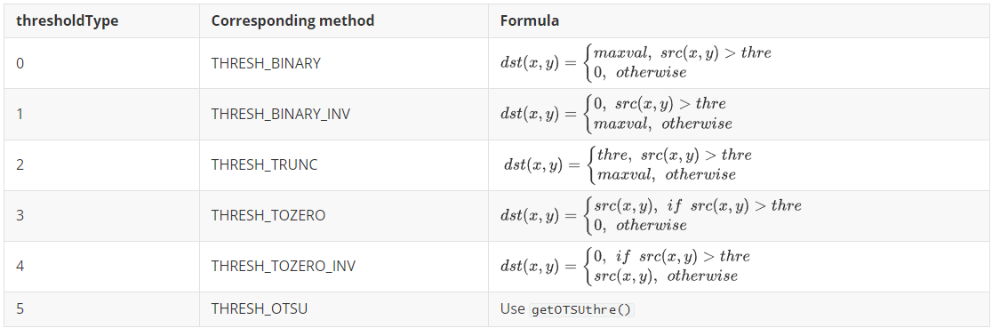

# PikaCV Image Processing Libraries

PikaCV implements some commonly used image processing algorithms.

## Install 

1. Add the dependency of PikaCV to requestment.txt.

   ```
   PikaCV
   ```

2. Run pikaPackage.exe

## Import

Add in main.py：

```python
#main.py
import PikaCV as cv
```

## class Image():

The Image class is the basis of the PikaCV,and subsequent image processing algorithms are based on the Image class.By creating an object of the Image class,an empty image can be created.Such as:

```python
import PikaCV
img = cv.Image()
```

### Image write and read

PikaCV can read Jpeg format files and write bmp format files.

```python
    def read(self, path: str):
        """Read the image from the specified path, 
        Need implement the   `__platform_fopen()`, `__platform_fread()`
          and `__platform_fclose()`"""
        ...

    def write(self, path: str):
        """Write the image to the specified path, 
        Need implement the   `__platform_fopen()`, `__platform_fwrite()` 
        and `__platform_fclose()`"""
        ...

    def loadJpeg(self, bytes: any):
        """Load the image from bytes"""

    def loadRGB888(self, width: int, height: int, bytes: bytes):
        """Load the image from bytes"""

    def loadRGB565(self, width: int, hight: int, bytes: bytes):
        """Load the image from bytes"""

    def loadGray(self, width: int, hight: int, bytes: bytes):
        """Load the image from bytes"""
```

### Image properties

The ``size`` of an image is  ``width * hight * channel``。

```python
    def width(self) -> int:
        """Get the width of the image"""

    def hight(self) -> int:
        """Get the hight of the image"""

    def format(self) -> int:
        """Get the format of the image. 
        The format is one of the `ImageFormat` enum, 
        like `ImageFormat.RGB888`"""
            def data(self) -> bytes:
        """Get the data of the image"""

    def getPixel(self, x: int, y: int, channel: int) -> int:
        """Get the pixel value of the specified channel.
        For example, if the format of image is `RGB888`, 
        the channel `0`, `1`, `2`, means `R`, `G`, `B`, 
        and for the format of `GRAY8`, the channel is `0`
        """

    def setPixel(self, x: int, y: int, channel: int, value: int):
        """Set the pixel value of the specified channel.
        For example, if the format of image is `RGB888`, 
        the channel `0`, `1`, `2`, means `R`, `G`, `B`, 
        and for the format of `GRAY8`, the channel is `0`
        """

    def size(self) -> int:
        """Get the size of the image by bytes"""
```

### Image operations

1. ``add()`` and ``minus()`` is pixel-by-pixel operation.When the result of the operation exceeds 255, it is classified as 255, and when it is below 0, it is classified as 0.
2. The channel order is RGB in ``merge()`` and ``split()`` 

## class Converter():

Converter class mainly implements the conversion between image formats, and currently Converter supports the following image storage formats and conversions

| From\To | RGB888 | RGB565 | Gray | BMP  | BGR888 |
| ------- | ------ | ------ | ---- | ---- | ------ |
| RGB888  | -      | √      | √    | *    | √      |
| RGB565  | √      | -      | √    | *    | √      |
| Gray    | √      | √      | -    | *    | √      |
| BMP     | √      | √      | √    | -    | √      |
| BGR888  | √      | √      | √    | √    | -      |

``-`` means no action，``*`` means that an intermediate transformation is required，`` √`` means that it can be converted directly

An example of an image format conversion operation is as follows:

```python
cv.Converter.toBMP(img)
```

## class Transforms():

The Transforms class mainly implements image transformation algorithms, and the transformation algorithms that have been implemented so far are:

1. ``rotateDown(image: Image)``

   This function can rotates the image by 180 degrees.

2. ``threshold(image:Image,thre:int,maxval:int,thresholdType:int)``

   This function is used to convert an image to a binary image.

   ``thre``:When the value of the thresholdType is 0-4, thre is used as the demarcation threshold for the image

   ``thresholdType``: Threshold type, which means as follows:

   
   
3. ``setROI(image:Image,x:int,y:int,w:int,h:int)``

   This function is used to select a ROI  from an image, the definition of the area is xywh, ``x`` and `` y `` represent the upper left vertex coordinates of the region,`` w`` represents the width of the area, and ``h`` represents the height of the area.

4. ``getOTSUthre(image:Image) -> int``

   This function implements [OTSU](https://u-aizu.ac.jp/course/bmclass/documents/otsu1979.pdf)，For the specific principle, please participate in the paper, the return value of the function is the threshold calculated by the OTSU method.

5. ``setOTSU(image:Image)``

   This function uses the OTSU algorithm to binaryize the image.

6. ``resize(image:Image,x:int,y:int,resizeType:int)``

   This function implements the scaling of the image, with x and y being the target size of the image

   ``resizeType``:The scaling method of the image. 0 represents the nearest neighbor algorithm.

7. ``adaptiveThreshold(image:Image,maxval:int,subsize:int,c:int,method:int)``

   ``method``：An algorithm used to calculate the threshold within a neighborhood. 0 represents mean filtering, 1 represents median filtering.

   ``c``:offset value

   ``subsize``: Convolutional kernel size

## class Filter

The Filter class implements some commonly used image filtering algorithms, and the algorithms that have been implemented so far are:

1. ``meanFilter(image:Image,ksizex:int,ksizey:int)``

   Mean filtering, ksizex and ksizey are the size of x and y of the convolutional kernels, respectively. There is currently no support for pads, so the size of the image after filtering equal ``W-F+1`` when ``ksizex=ksizey``.

2. ``medianFilter(image:Image)``

   Median filtering, currently only supports convolutional kernels with a size of 3*3.

   
