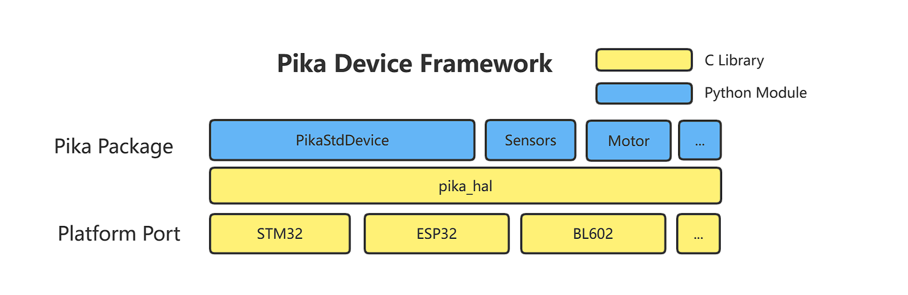

# PikaStdDevice Standard Device

PikaStdDevice is an abstract device model that provides a unified API for peripherals across platforms.
## Installation

- Add the PikaStdDevice dependency to requestment.txt.
```
PikaStdDevice
```

- Run pikaPackage.exe
## Why do we need a standard device module
What is a standard device module? Let's start with other scripting technologies, such as MicroPython, there is no unified API for peripheral calls, which makes users need to relearn the API when using different platforms, for example, the following is the code for MicroPython to drive GPIO on STM32F4 platform.


This is the ESP8266


It is obvious that when selecting the pin, one uses a string, while the other uses an integer, and when controlling the level, one uses the `high()` and `low()` methods, while the other uses the `on()` and `off()` methods.
Is there any way to unify the APIs of peripherals, so that users only need to be familiar with a set of APIs, they can be common in any platform?
There is a way, and it is the PikaStdDevice standard device driver module.

## Module structure

assets/image-20221207125315706.png)

- The `PikaStdDevice` module provides the basic peripheral Python modules for `GPIO`, `IIC`, `PWM`, etc.
- `PikaStdDevice` is based on the `pika_hal` device abstraction layer. `pika_hal` is a pure `c` language device abstraction layer that unifies peripheral operations of different platforms into the same `API` for `PikaStdDevice` to call, so that different platforms (STM32, ESP32, BL602) etc. can use common `Python` code to control the device.
- The `pika_hal` device abstraction layer needs to be adapted in different platforms (Platform Port), by rewriting the `WEAK` function like `pika_hal_platform_xxxx()` in different platforms, it is possible to provide support for different platforms.
- Besides `PikaStdDevice` modules, there are also `Python` modules like `sensor` / `motor`, which are based on `pika_hal`. These modules use `GPIO`, `IIC`, `PWM` and other adapted functions of `pika_hal`, so no additional adaptations are needed besides `pika_hal` to use them.

## `PikaStdDevice` module example

Using the GPIO module as an example, here is the user API defined by PikaStdDevice

``` python
class GPIO:
    def __init__(self):
        pass

    def init(self):
        pass

    def setPin(self, pinName: str):
        pass

    def setId(self, id: int):
        pass

    def getId(self) -> int:
        pass

    def getPin(self) -> str:
        pass

    def setMode(self, mode: str):
        pass

    def getMode(self) -> str:
        pass

    def setPull(self, pull: str):
        pass

    def enable(self):
        pass

    def disable(self):
        pass

    def high(self):
        pass

    def low(self):
        pass

    def read(self) -> int:
        pass

```

The sample code for the `PikaStdDevice` module is under the https://gitee.com/Lyon1998/pikascript/tree/master/examples/Device path. The `machine` module in the example is a simple renaming of the `PikaStdDevice` module.

## `pika_hal` device abstraction layer

### Design philosophy

- Efficient. Pure C implementation, with streamlined internal links.

- Standard. `linux`-like design, all types of device operations have and only have 5 standard file-like APIs: `open()`, `close()`, `write()`, `read()`, `ioctl()`.

### Programming model

! [image-20221207132547828](assets/image-20221207132547828.png)

All devices follow the linux-like file programming model, all types of devices use the `pika_dev` structure as a device handle, and all types of devices have and only have the following five control APIs.

### `open()`

- Overview

    The `open()` function is used to open a device and is called first.

- The function prototype

    ``` c 
    pika_dev* pika_hal_open(PIKA_HAL_DEV_TYPE dev_type, char* name);
    ```

- Parameter

| parameter | type | function | comment |
| -------------|--------------- | -------- | ------------------------------------------------------------ |
| `dev_type` | `PIKA_HAL_DEV_TYPE ` | Device type | e.g. `PIKA_HAL_GPIO` is `GPIO` device, `PIKA_HAL_SPI` is `SPI` device. | name
| `name` | `char* ` | device name | e.g. `PA0`, `SPI2`, etc., `pika_hal_open()`. |
| `(return)` | `pika_dev` | device_handle | Returns a pointer to the device handle `pika_dev` if the device is successfully opened, or `NULL` if the opening fails. |## ###

### `close()`

- Overview

    The `close()` function is used to close a device, and is called last, to avoid memory leaks.

- Function prototype

  ```c
  int pika_hal_close(pika_dev* dev);
  ```
- Parameters

| parameter | type | function | note |
| --------------- | --|------ | ------------------------------------------------------------ |
| `dev` | `pika_dev* ` | Device handle | The handle of the device to be operated. ||dev
| `(return)` | `int` | error value | An error value of `0` indicates a successful operation, while other return values indicate a failed operation and the return value is an error code. |

### `ioctl()`

- Overview

    The `ioctl()` function is used to control the device, including

    - config
    - enable
    - disable - disable

- Function prototypes

  ```c
  int pika_hal_ioctl(pika_dev* dev, PIKA_HAL_IOCTL_CMD cmd, ...) ;
  ```

- Parameter

| Parameter | Type | Function | Remarks |
| -------------------|----- | -------- | ------------------------------------------------------------ |
| `dev` | `pika_dev*` | Device handle | The handle of the device to be manipulated. | |pika_dev
| `cmd` | `PIKA_HAL_IOCTL_CMD` | ` | Control commands|
| `... ` | `(None)/pika_hal_config_XXXX \*` | Control parameter | This parameter can be filled or unfilled, depending on the value of `cmd`. When `cmd` is `PIKA_HAL_IOCTL_ENABLE`, `PIKA_HAL_IOCTL_DISABLE`, this parameter is not filled. When `cmd` is `PIKA_HAL_IOCTL_CONFIG`, the parameter is `pika_hal_config_XXXX \*cfg`, where `XXXX` is the type of the device, such as `pika_hal_config_GPIO`, `pika_hal_config_SPI`, etc., which should be the same as the type of the device used in `pika_hal_open()`. |
| `(return)` | `int ` | error_value | An error value of `0` means the operation succeeded, other return values mean the operation failed and the return value is an error code. |

### `read()`

- Overview

    The `read()` function is used to read data from a device.

- Function prototype

  ```c
  int pika_hal_write(pika_dev* dev, void* buf, size_t len);
  ```
- Parameters

| parameter | type | function | note |
| ---------- | ------------ | ------------ | ------------------------------------------------------------ |
| `dev` | `pika_dev* ` | Device handle | The handle of the device to be manipulated.                                           | `buf
| `buf` | `void*` | read buffer | For devices like `GPIO, ADC` that can only read single data, use `uint32_t` for the buffer. |
| `len` | `size_t` | number of bytes to read | For devices like `GPIO, ADC` that can only read single data, the length is `sizeof(uint32_t)`. |
| `(return)` | `int` | error_value | An error value of `0` means the operation succeeded, other return values mean the operation failed, and the return value is the error code. |

### `write()`

- Overview

    The `write()` function is used to write data to a device.

- The function prototype

  ```c
  int pika_hal_write(pika_dev* dev, void* buf, size_t len);
  ```
- Parameter

| parameter | type | function | note |
| ---------- | ------------ | ------------ | ------------------------------------------------------------ |
| `dev` | `pika_dev* ` | Device handle | The handle of the device to be manipulated.                                           | `buf
| `buf` | `void*` | write buffer | For devices like `GPIO, DAC` that can only write single data, the buffer uses `uint32_t`. | `len
| `len` | `size_t` | Number of bytes written | For devices like `GPIO, DAC` that can only read single data, the length is `sizeof(uint32_t)`. |
| `(return)` | `int` | error_value | An error value of `0` means the operation succeeded, other return values mean the operation failed, and the return value is the error code. |

### Driver adaptation

Adapt `pika_hal` to the platform by rewriting the following `pika_hal_platform_XXXX` prefixed `WEAK` functions for the device, where `XXXX` is the device type name, such as `GPIO`, `PWM`, etc.

```c
PIKA_WEAK int pika_hal_platform_XXXX_open(pika_dev* dev, char* name);
PIKA_WEAK int pika_hal_platform_XXXX_close(pika_dev* dev);
PIKA_WEAK int pika_hal_platform_XXXX_read(pika_dev* dev, void* buf, size_t count);
PIKA_WEAK int pika_hal_platform_XXXX_write(pika_dev* dev, void* buf, size_t count);
PIKA_WEAK int pika_hal_platform_XXXX_ioctl_enable(pika_dev* dev);
PIKA_WEAK int pika_hal_platform_XXXX_ioctl_disable(pika_dev* dev);
PIKA_WEAK int pika_hal_platform_XXXX_ioctl_config(pika_dev* dev, pika_hal_XXXX_config* cfg);
```

Reference adaptation code.

[https://gitee.com/Lyon1998/pikapython/tree/master/package/BLIOT](https://gitee.com/Lyon1998/pikapython/tree/master/package/BLIOT)
[https://gitee.com/Lyon1998/pikapython/tree/master/package/STM32G0](https://gitee.com/Lyon1998/pikapython/tree/master/package/STM32G0)
[https://gitee.com/Lyon1998/pikapython/tree/master/package/ESP32](https://gitee.com/Lyon1998/pikapython/tree/master/package/ESP32)

### Case Tutorial 1 - Adaptation of WIFI devices on ESP32
[source link](https://gitee.com/Lyon1998/pikapython/blob/master/package/ESP32/pika_hal_ESP32_WIFI.c)

First, we need to include some necessary header files such as pika_hal.h, esp_wifi.h, esp_event.h, etc. These header files provide the definitions and functions related to pika_hal and esp32.

```c
#include "... /pikascript-lib/pikastddevice/pika_hal.h"
#include "esp_event.h"
#include "esp_mac.h"
#include "esp_netif.h"
#include "esp_wifi.h"
#include "freertos/freertos.h"
#include "freertos/event_groups.h"
#include "freertos/task.h"
#include "nvs_flash.h"
```
Then, we define some global variables and constants to record the status and configuration information of WIFI. For example, wifi_started indicates whether WIFI has been started, wifi_sta_connect_requested indicates whether a connection to a WIFI hotspot was requested, wifi_sta_disconn_reason indicates the reason for a failed connection, etc.

```c
static volatile pika_bool wifi_started = pika_false;
static volatile pika_bool wifi_sta_connect_requested = pika_false;
static volatile pika_bool wifi_sta_connected = pika_false;
static volatile pika_hal_wifi_status wifi_sta_disconn_reason = pika_false; static volatile pika_hal_wifi_status wifi_sta_disconn_reason =
    pika_hal_wifi_status_idle;
static eventgrouphandle_t wifi_event_group;
static esp_netif_t* sta_netif = null;
static esp_netif_t* ap_netif = null;
```

Next, we define a helper function _ip_str2u32 that converts the IP address in string form to a value of type uint32_t. This function iterates over each number in the string and stores it in an array of type uint8_t, then returns the uint32_t value represented by this array.

```c
uint32_t _ip_str2u32(char* ip_str) {
    uint32_t ip = 0;
    uint8_t* ip_u8 = (uint8_t*)&ip;
    char* p = ip_str;
    for (int i = 0; i < 4; i++) {
        ip_u8[i] = atoi(p);
        p = strchr(p, '.') ;
        if (p == null) {
            break;
        }
        p++;
    }
    return ip;
}

```
Immediately afterwards, we define an event handler function event_handler to respond to events of different types and IDs and to perform the corresponding actions based on the event data. For example, in the WIFI_EVENT_STA_START event, the esp_wifi_connect function is called if a connection to a hotspot is requested; in the IP_EVENT_STA_GOT_IP event, the wifi_sta_connected is set to PIKA_TRUE and the wifi_sta_disconn_reason is set to PIKA_TRUE. disconn_reason to PIKA_HAL_WIFI_STATUS_GOT_IP, etc.

```c
static void event_handler(void* event_handler_arg,
                          esp_event_base_t event_base,
                          int32_t event_id,
                          void* event_data) {
    // ...
}
```

Then, we implement several main device manipulation functions corresponding to turning on, turning off, configuring and controlling the WIFI device. Each of these functions requires passing a pointer to a device object (pika_dev) and returns the corresponding result or error code, depending on the case.
- The `pika_hal_platform_WIFI_open` function is used to initialize the NVS (non-volatile storage), the network interface and the event loop, and to create an event group.
- The `pika_hal_platform_WIFI_close` function is used to deinitialize the NVS, the network interface and the event loop, and to delete the event group.
- The `pika_hal_platform_WIFI_ioctl_config` function is used to configure the WIFI mode, hotspot information, etc. based on the ioctl_config field (type pika_hal_WIFI_config) in the device object. In case of STA mode, the configuration is not supported; in case of AP mode, the esp_wifi_set_config function is called to set the SSID, password, channel, authentication mode and maximum number of connections of the hotspot, etc.
- The `pika_hal_platform_WIFI_ioctl_enable` function is used to start or stop the WIFI. first, the mode of the WIFI is determined according to the mode field in the ioctl_config field, and then the esp_wifi_set_mode function is called to set the mode. If WIFI is not yet started, you also need to register the event handler function, create the default network interface, and call the esp_wifi_start function to start WIFI and set wifi_started to PIKA_TRUE; otherwise, you just need to set the mode.
- The `pika_hal_platform_WIFI_ioctl_disable` function is used to stop or deinitialize WIFI. if WIFI is already started, call the esp_wifi_stop and esp_wifi_deinit functions to stop and deinitialize WIFI and set wifi_started to PIKA_FALSE; otherwise, -1 is returned to indicate an error.

- The `pika_hal_platform_WIFI_ioctl_others` function is used to handle other types of control commands, such as getting the status of the WIFI, whether it is active or not, scanning for nearby hotspots, etc. These commands are specified by the cmd parameter and data is passed or returned by the arg parameter. For example, in the PIKA_HAL_IOCTL_WIFI_GET_STATUS command, the current connection status is determined based on variables like wifi_sta_connect_requested and wifi_sta_connected and assigned to the pika_hal_wifi_ status variable pointed to by arg. status variable.


## Contribute

Please refer to the documentation in the [Contribute to the community -> Contribute module](%E5%A6%82%E4%BD%95%E8%B4%A1%E7%8C%AE%20PikaScript%20%E6%A8%A1%E5%9D%97. html) section of the documentation to post the module you have written.
