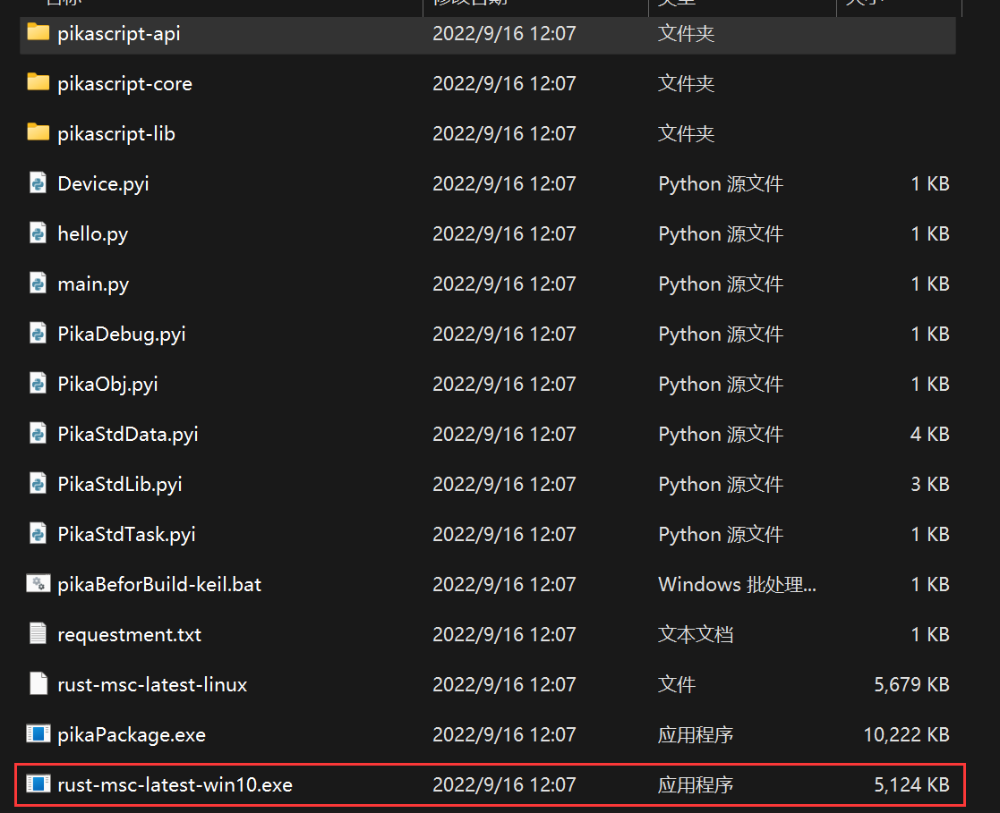
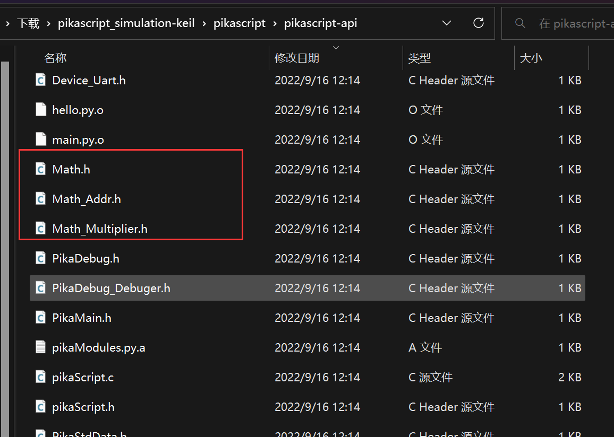
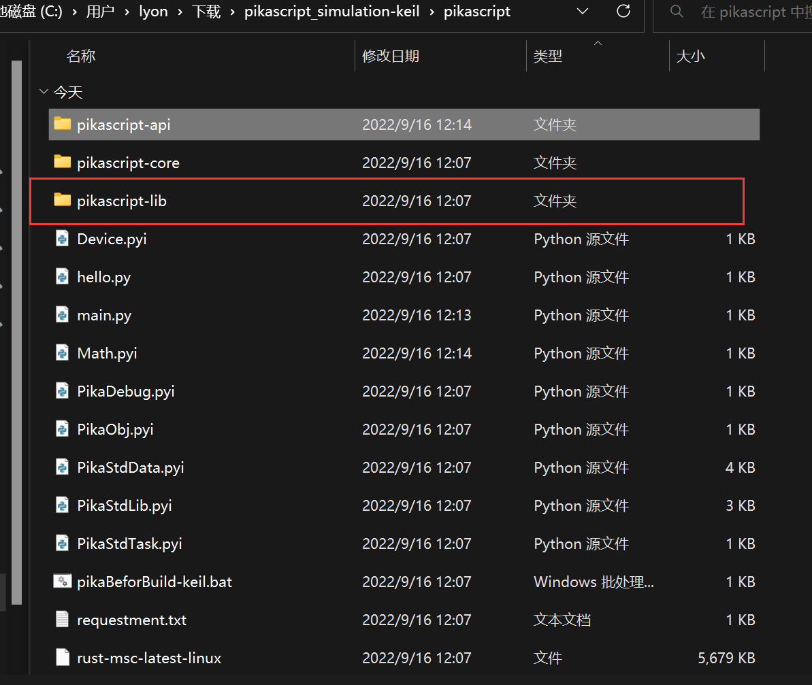
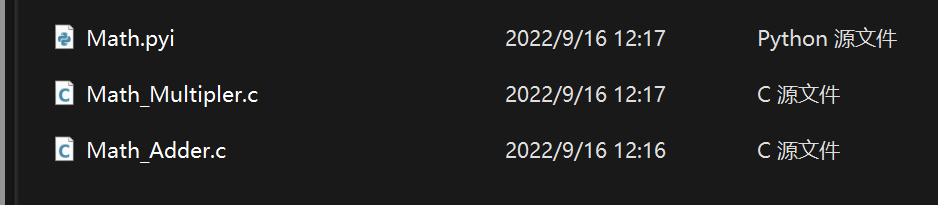

# PikaScript C module development process

We still use keil's simulation project as an example, if you haven't got the simulation project yet, please refer to [1. Three minutes to get started quickly](https://pikadoc.readthedocs.io/en/latest/Keil%20%E4%BB%BF%E7%9C%9F%E5%B7%A5%E7%A8%8B.html)

### New module interface


To write a new module, you first need to write a module interface file, for example, to write a math calculation module Math, the first step is to write Math.pyi.

### Writing class interfaces

Now we can create new classes inside Math.pyi. For example, if we want to create a new `Adder` class to implement the relevant addition operations, we can add the Adder class inside Math.pyi.

Then we want Adder to provide addition operations for plastic and floating-point data, so we can add the byInt and byFloat methods.

```python
# Math.pyi
class Adder:
    def byInt(self, a:int, b:int)->int:
        pass
    def byFloat(self, a:float, b:float)->float:
        pass
```

Use `...` to replace `pass` is also avaliable，for example:

```python
# Math.pyi
class Addr:
    def byInt(self, a:int, b:int)->int:...
    def byFloat(self, a:float, b:float)->float:...
```

The above code defines the `Adder` class and adds two method declarations, ```byInt(self, a:int, b:int)->int```, indicating that the method name is ``byInt``, the input parameters are ``a`` and ``b``, the type of ``a`` and ``b`` are both ``int``, and the return value is also ``int``. and the return value is determined by `->int`, which is the standard python syntax for writing with type annotations.

The first argument of a method of a class in python is `self`, which is required by python syntax.

We add a Multiplier class to math.py to implement multiplication, which is written as follows.

```python
# Math.pyi
class Multiplier:
    def byInt(self, a:int, b:int)->int:
        pass
    def byFloat(self, a:float, b:float)->float:
        pass
```

This is the end of the interface. We introduce the Math module in main.py so that the Pika precompiler will go ahead and precompile the Math module.

```python
# main.py
import Math
```

Double-click to run the pika precompiler.



Opening the pikascript-api folder shows that our newly written module interface is ready to be compiled.



### Writing the class implementation

Try compiling them.


found that the compilation reported an error, suggesting that there are four functions not found in the definition.


This is normal because we did not write implementations for the classes of the Math module before, and we will write implementations for those classes below.


For the convenience of module management, we put all the implementation files in the pikascript-lib folder.



Under the pikascript-lib folder, create a new Math folder to hold the implementation code for the Math module.


Then create a new .c file in the Math folder. It is recommended to use the naming scheme "module_class_name.c" to create a new .c file for each class to improve the clarity of the code.


Then we write the method implementation of the class inside these two .c files. So the question arises, how do we know which implementations should be written?


This is easy, we open Math_Multiplier.h and Math_Adder.h to find that the implementation functions we need to write have already been declared.


``` C
/* Math_Multiplier.h */
/* ******************************** */
/* Warning! Don't modify this file!
/* ******************************** */
#ifndef __Math_Multiplier__H
#define __Math_Multiplier__H
#include <stdio.h>
#include <stdlib.h>
#include "PikaObj.h"

PikaObj *New_Math_Multiplier(Args *args);

double Math_Multiplier_byFloat(PikaObj *self, double a, doutlb b);
int Math_Multiplier_byInt(PikaObj *self, int a, int b);

#endif
```


``` c
/* Math_Adder.h */
/* ******************************** */
/* Warning! Don't modify this file!
/* ******************************** */
#ifndef __Math_Adder__H
#define __Math_Adder__H
#include <stdio.h>
#include <stdlib.h>
#include "PikaObj.h"

PikaObj *New_Math_Adder(Args *args);

double Math_Adder_byFloat(PikaObj *self, double a, double b);
int Math_Adder_byInt(PikaObj *self, int a, int b);

#endif
```


Then we directly implement these four functions in Math_Adder.c and Math_Multipler.c and we're good to go.


```c
/* Math_Adder.c */
#include "pikaScript.h"

double Math_Adder_byFloat(PikaObj *self, double a, double b)
{
	return a + b;
}

int Math_Adder_byInt(PikaObj *self, int a, int b)
{
	return a + b;
}
```


```c
/* Math_Multipler.c */
#include "pikaScript.h"

double Math_Multiplier_byFloat(PikaObj *self, double a, double b)
{
	return a * b;
}

int Math_Multiplier_byInt(PikaObj *self, int a, int b)
{
	return a * b;
}
````


At this point,compile the project again and it will pass.


### Test the effect


Let's test our newly written module with the following main.py


```python
# main.py
import Math

adder = Math.Adder()
muler = Math.Multiplier()

res1 = adder.byInt(1, 2)
print('1 + 2')
print(res1)

res2 = adder.byFloat(2.3, 4.2)
print('2.3 + 4.2')
print(res2)

res3 = muler.byInt(2, 3)
print('2 * 3')
print(res3)

res4 = muler.byFloat(2.3, 44.2)
print('2.3 * 44.2')
print(res4)
```


The result of the run is as follows.


This shows that the module we wrote is working correctly.

### Available type annotations

The following table lists all the type declarations supported by PikaScript, and how they correspond to the native types of the C language.

| Python type annotations | C native types | description |
| --------------- | ----------- | -- |
| int | int | python basic types |
| int64           | int64_t     | 64 bits int |
| float | double | python basic types |
| str | char * | python basic type |
| bytes | uint8_t * | python basic type |
| pointer | void * | PikaScript-specific type annotations |
| any | Arg* | PikaScript-provided generic containers |
| any class | PikaObj * |PikaScript-provided object container|

> **Note** 
> 1. `str` is returned as `char*` in c. If the string to be returned is a local variable in the function, it needs to be cached with `obj_cacheStr` to avoid dangling references when it goes out of the function scope, e.g.: `return obj_cacheStr(self, res);`.
> 2. `bytes` as return value returns `Arg*` in c. This is because `bytes` needs to specify the length and returning `uint8_t*` does not meet the requirement. The correct way to return is: `return arg_newBytes(bytes, len);`.

Translated with www.DeepL.com/Translator (free version)


### Publishing modules


In the spirit of open source, it is very cool and exciting to publish your own modules.


All you need to do to publish a module is to publish the class interface and class implementation files.


For example, to publish the newly written Math module, you publish the Math.pyi file and the files in pikascript-lib/Math folder.



Please refer to the documentation in the **Participate in Community Contributions** section to distribute the modules you write.
