# How to contribute to the standard library

## What are PikaPython standard libraries?

PikaPython standard libraries are a set of cross-platform libraries for common tools such as string, time, etc.

Some of these libraries provide APIs consistent with or similar to CPython, and some provide common tools for MCU development.

## PikaPython standard library development environment construction

The PikaPython standard library is cross-platform, so it can't use the proprietary resources of the platform (e.g. stm32), to ensure this, the standard library is developed on linux platform.

PikaPython deploys GoogleTest unit testing framework on linux platform to provide test cases for these standard libraries, GoogleTest can be run on the developer's local machine and also automatically in the cloud (based on Github Actions).

### Build Docker container

[ get start -> get start with docker](get-start_linux.html)

## Use VSCODE to connect to the container for development

### Start

VSCODE provides tools to connect to containers for development, and the development experience is as good as if you were outside the container.

Select Remote, Containers, pikadev in the VSCODE sidebar, then click Open Directory to connect to Docker inside VSCODE.

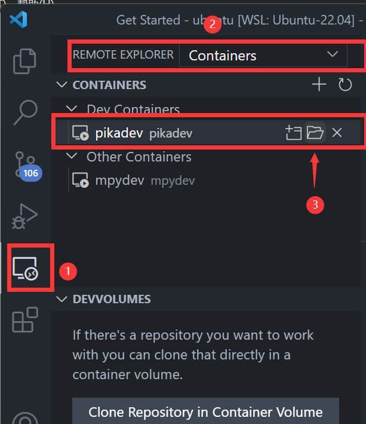

The first time you open it, you need to wait for some plugins to be installed automatically, then you can open it again and start it directly.

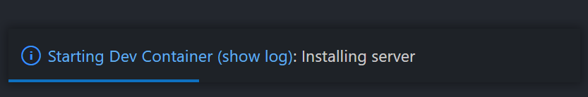

 cd to ~/pikascript/port/linux, then type `code . ` to switch the working path to pikascript/port/linux

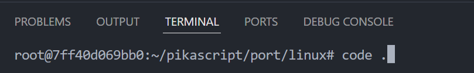

### Compile and run
- Initialize
```
sh pull-core.sh # Update kernel source code
```
- Pre-compile and configure CMake
```
sh init.sh
```
- Compile
```
sh only_make.sh
```
- test
```
sh gtest.sh # run google test
sh ci_benchmark.sh # run benchmark
sh valgrind.sh # run valgrind
```
- run
```
sh run.sh # Start REPL
```

### Development

The pyi declaration files for the standard library are in the package/pikascript directory. The standard library includes PikaStdLib.pyi, PikaStdData.pyi, PikaDebug.pyi, PikaStdTask.pyi, etc.

 The implementation files are in the PikaStdLib folder.

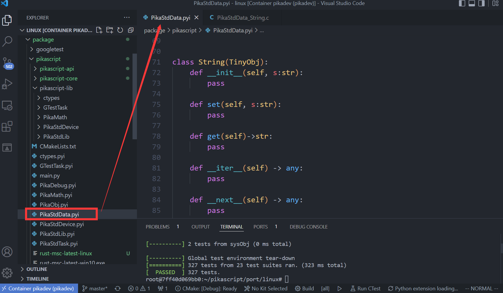

Then you can add classes, or functions to the standard library, for example, add a `startswith()` method to the `PikaStdData.String` class by first adding a declaration for the `startswith()` method under the `String` class in PikaStdData.pyi.

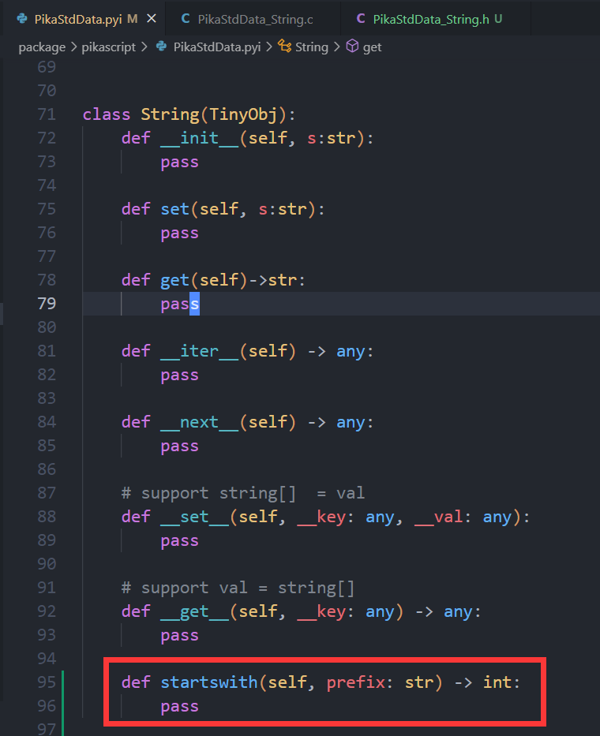

Then run.

```
sh init.sh
```

to pre-compile and reconfigure CMake.

Then open ``PikaStdData_String.h`` and you will find the c function declaration for the automatically generated startswith method.

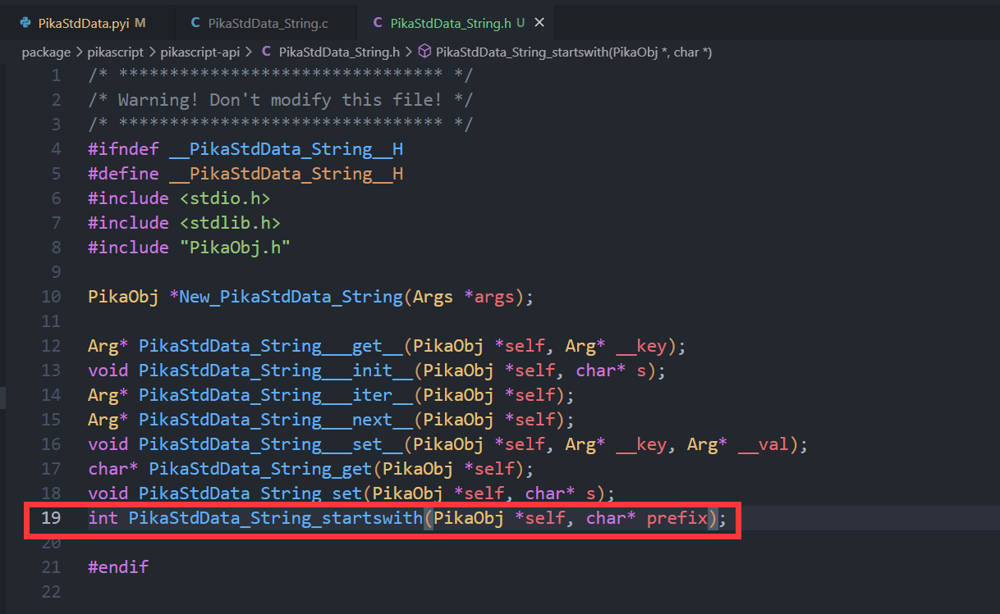

Next, implement this function in PikaStdData_String.c.

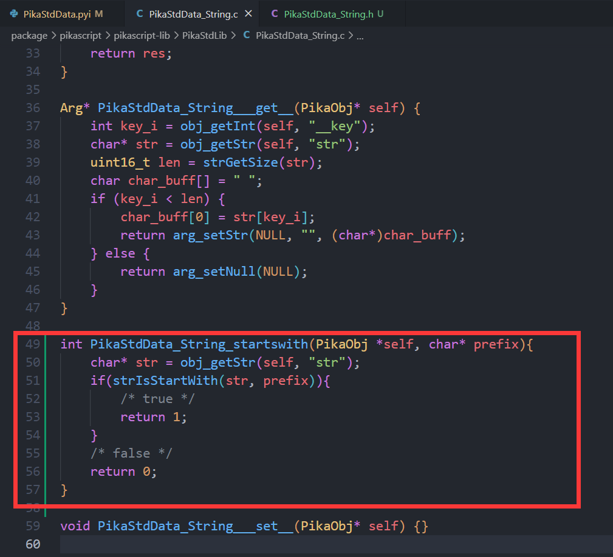

### Testing

Then you can run GoogleTest to see if it breaks the original code.

```
sh gtest.sh 
```

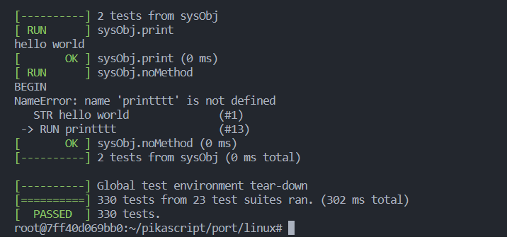

If the tests all pass, you can write the code for the functional tests.

The test code is in the test directory.

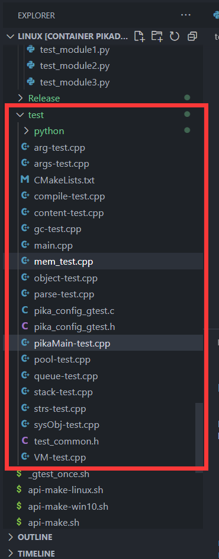

The tests for the standard library can be placed under pikaMain-test.cpp.

The contents of a test case are as follows: first, declare a test case with the TEST macro, then fill in the name of the test group, and the name of the test case, the name of the test group can be the same as the other test cases in the current file, the test name needs to be different from the other test cases.

```C
TEST(<test group>, <test name>){

    /* do something */

    /* assert */
    
    /* deinit */
}
```

The measurement example is divided into three main parts.

- Running

- Judgment

- Analysis

  Here is a typical test case, we copy this test case and change the name of the test case.

  ``` C
  TEST(pikaMain, a_signed) {
      /* init */
      pikaMemInfo.heapUsedMax = 0;
      PikaObj* pikaMain = newRootObj("pikaMain", New_PikaMain);
      /* run */
      obj_run(pikaMain, "a = -1\n");
      /* collect */
      int a = obj_getInt(pikaMain, "a");
  
      /* assert */
      EXPECT_EQ(-1, a);
  
      /* deinit */
      obj_deinit(pikaMain);
      EXPECT_EQ(pikaMemNow(), 0);
  }
  ```

We modify the `obj_run()` part, run a python script, and then take the result and use the EXPECT_EQ macro to determine the result.

``` C
TEST(pikaMain, string_startswith) {
    /* init */
    pikaMemInfo.heapUsedMax = 0;
    PikaObj* pikaMain = newRootObj("pikaMain", New_PikaMain);
    /* run */
    obj_run(pikaMain, 
    "a = PikaStdData.String('test')\n"
    "res1 = a.starswith('te')\n"
    "res2 = a.startswith('st')\n"
    );
    /* collect */
    int res1 = obj_getInt(pikaMain, "res1");
    int res2 = obj_getInt(pikaMain, "res2");

    /* assert */
    EXPECT_EQ(res1, 1);
    EXPECT_EQ(res2, 0);

    /* deinit */
    obj_deinit(pikaMain);
    EXPECT_EQ(pikaMemNow(), 0);
}
```

The `EXPECT_EQ` macro is provided by GoogleTest to determine if two values are equal, if not, GoogleTest will throw an error, you can check GoogleTest's documentation to learn more.

Then we run GoogleTest again

```
sh gtest.sh
```

As you can see, the number of test cases is 331, one more than the previous 330, and they all pass, which means the test is successful.

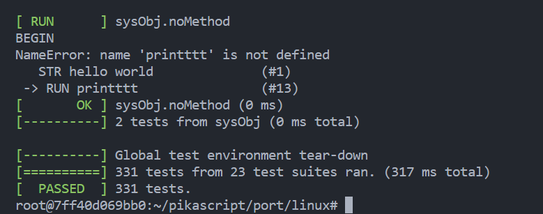

### Commit

Once the test passes, you can commit the changes.

Before committing the changes, you need to fork the PikaPython repository, Gitee and Github are both available.

The first time you commit, you need to change your commit information, including your username, email, and the repository address after fork.

```
git config --global user.name < your user name >
git config --global user.email < your email >
git config remote.origin.url < your forked git repo url >
```

Run

```
sh push-core.sh
```

Commit the modified code to ~/pikascript/package/PikaStdLib.

Then run

```
git commit -a
```

Enter the commit information, and if you are not familiar with vim, learn the basics of using vim yourself.


Next you can commit

``` 
git push
```

If there is a conflict, you can first

```
git pull --rebase
```

and then ``git push``. For more information on how to use git, see the git manual.

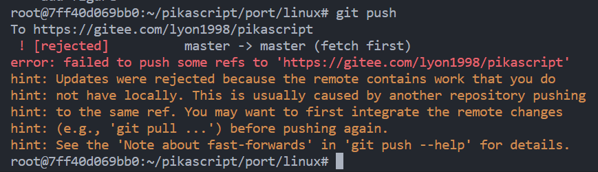

Then launch a Pull Request in gitee / github


