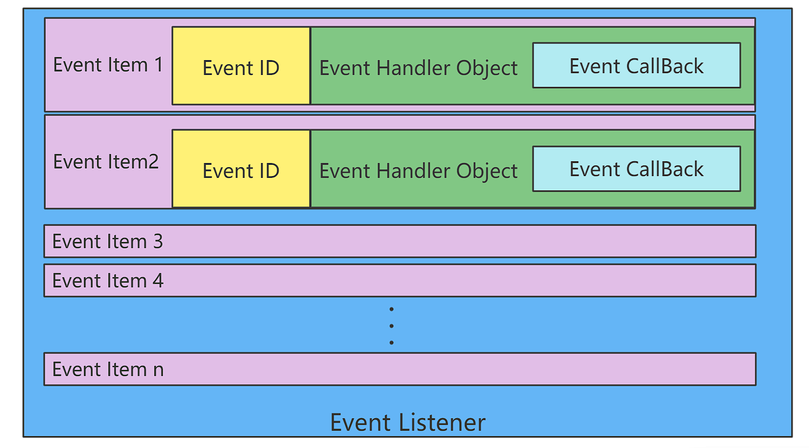
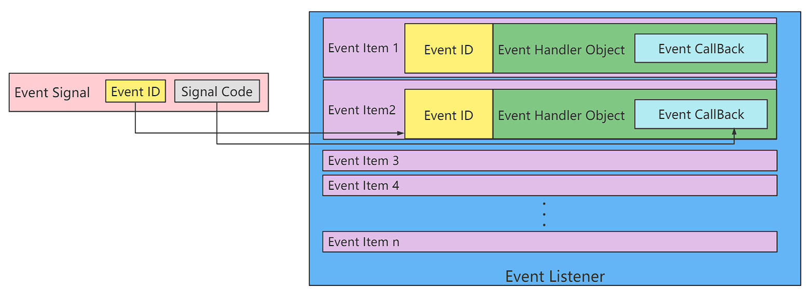

# Event callback mechanism

## Overview

The PikaScript kernel provides an event callback mechanism that supports triggering Python defined callback functions in C events/interrupts.

Note: requires kernel version no less than: v1.8.7

## Headers

``` C
#include "PikaObj.h"
```

## Data types

``` c
typedef PikaObj PikaEventListener;
```

The event callback mechanism relies on the `PikaEventListener` event listener, which records the ID of each registered event. When a signal is sent to the event listener, the event listener will call the corresponding Python callback function based on the event ID, and pass the semaphore.

## The Event Model

The core of the event model is the `PikaEventListener` event listener.



The `PikaEventListener` model is shown above. After registering an event to the event listener, an event item `Event Item` will be recorded inside the `PikaEventListener`, including.

- `Event ID` the unique ID of the event
- `Event Handler Object` event object, which records all the information about the event item
- `Event CallBack` event callback function ( Python function )


When the `Event Signal` event signal arrives, the event listener will match the `Event ID` to find the corresponding event item, then pass the signal code `Event Code` to `Event CallBak` to trigger the callback function.




## Support event callbacks via PikaStdDevice

Inheriting PikaStdDevice is the easiest way to support event callbacks, the ``PikaStdDevice.BaseDev`` device base class already supports the event registration method ``addEventCallBack``.

```python
class BaseDev(TinyObj):
    def addEventCallBack(self, eventCallback: any): ...

    # need override
    def platformGetEventId(self): ...
```

- The device classes in `PikaStdDevice` (e.g. GPIO) all inherit from `BaseDev`, so they all get the `addEventCallBack` method and can register callbacks.

[/package/PikaStdDevice/PikaStdDevice.pyi](https://gitee.com/Lyon1998/pikascript/blob/master/package/PikaStdDevice/PikaStdDevice. pyi)

``` python
class GPIO(BaseDev):
...
```
After the platform driver inherits from `PikaStdDevice.GPIO`, it also gets the `addEventCallBack` method.

[/package/TemplateDevice/TemplateDevice.pyi](https://gitee.com/Lyon1998/pikascript/blob/master/package/TemplateDevice/ TemplateDevice.pyi)

``` python
# TemplateDevice.pyi
class GPIO(PikaStdDevice.GPIO):
    # overrid
--
    def platformGetEventId(self): ...
---
```

Just override the `platformGetEventId` platform method to be able to support registration callbacks.

For example.

[/package/TemplateDevice/TemplateDevice_GPIO.c](https://gitee.com/Lyon1998/pikascript/blob/master/package/TemplateDevice/ TemplateDevice_GPIO.c)

``` c
const uint32_t GPIO_PA8_EVENT_ID = 0x08;
void TemplateDevice_GPIO_platformGetEventId(PikaObj* self) {
    char* pin = obj_getStr(self, "pin");
    if (strEqu(pin, "PA8")) {
        obj_setInt(self, "eventId", GPIO_PA8_EVENT_ID);
    }
}
```

## Registering callback functions in Python

- Define a callback function `callBack1` that takes an input parameter `signal`, `signal` can receive the incoming signal number.

[/examples/TemplateDevice/gpio_cb.py](https://gitee.com/Lyon1998/pikascript/blob/master/examples/TemplateDevice/gpio_cb.py)

``` python
import TemplateDevice

io1 = TemplateDevice.GPIO()
io1.setPin('PA8')
io1.setMode('in')
io1.enable()

EVENT_SIGAL_IO_RISING_EDGE = 0x01
EVENT_SIGAL_IO_FALLING_EDGE = 0x02

def callBack1(signal):
    if signal == EVENT_SIGAL_IO_RISING_EDGE:
        print('get rising edge!')
    elif signal == EVENT_SIGAL_IO_FALLING_EDGE:
        print('get falling edge!')

io1.addEventCallBack(callBack1)
```


## Signal triggering

Send a signal to `PikaEventListener` when an event callback needs to be triggered.

Example: [/port/linux/test/event-test.cpp](https://gitee.com/Lyon1998/pikascript/blob/master/port/linux/test/event-test.cpp)

- Get the event listener provided by `PikaStdDevice` via `extern PikaEventListener* g_pika_device_event_listener`.

- Send `eventID` and `signal code` via `pks_eventLisener_sendSignal`. 

``` c
extern PikaEventListener* g_pika_device_event_listener;
#define EVENT_SIGAL_IO_RISING_EDGE 0x01
#define EVENT_SIGAL_IO_FALLING_EDGE 0x02
#define GPIO_PA8_EVENT_ID 0x08
TEST(event, gpio) {
    /* init */
    PikaObj* pikaMain = newRootObj("pikaMain", New_PikaMain);
    /* run */
    pikaVM_runFile(pikaMain, "... /... /examples/TemplateDevice/gpio_cb.py");
    /* simulate run in the call back */
    pks_eventLisener_sendSignal(g_pika_device_event_listener, GPIO_PA8_EVENT_ID,
                            EVENT_SIGAL_IO_RISING_EDGE);
    pks_eventLisener_sendSignal(g_pika_device_event_listener, GPIO_PA8_EVENT_ID,
                            EVENT_SIGAL_IO_FALLING_EDGE);
...
}
```

- Running results.

```
get rising edge!
get falling edg!
```

## Advanced: Custom event registration functions

- In addition to event callbacks supported by `PikaStdDevice`, you can also customize event registration functions, which is an advanced part.

- Custom event registration requires a better understanding of PikaScript's C-module mechanism and object mechanism.

- Define a Python interface to a C module that receives incoming event callback functions.

For example.

[/package/PikaStdDevice/PikaStdDevice.pyi](https://gitee.com/Lyon1998/pikascript/blob/master/package/PikaStdDevice/PikaStdDevice. pyi)

```python
class BaseDev(TinyObj):
    def addEventCallBack(self, eventCallback: any): ...
```

The type annotation for the event callback function is ``any``.

- Registering events in the C module implementation

Example: [/package/PikaStdDevice/PikaStdDevice_BaseDev.c](https://gitee.com/Lyon1998/pikascript/blob/master/package/PikaStdDevice/ PikaStdDevice_BaseDev.c)

```c
PikaEventListener* g_pika_device_event_listener;

void PikaStdDevice_BaseDev_addEventCallBack(PikaObj* self, Arg* eventCallBack) {
    obj_setArg(self, "eventCallBack", eventCallBack);
    /* init event_listener for the first time */
    if (NULL == g_pika_device_event_listener) {
        pks_eventLisener_init(&g_pika_device_event_listener);
    }
    if (PIKA_RES_OK != obj_runNativeMethod(self, "platformGetEventId", NULL)) {
        obj_setErrorCode(self, 1);
        __platform_printf("Error: Method %s no found.\r\n",
                          "platformGetEventId");
    }
    uint32_t eventId = obj_getInt(self, "eventId");
    pks_eventLicener_registEvent(g_pika_device_event_listener, eventId, self);
}
```

- Create a global `PikaEventListener`: `g_pika_device_event_listener`.
- Pass `self` as `event handler object` and `evnetCallBack` into `self`.
- Get `evnetID`.
  - This example gets the `eventID` by calling the `platformGetEventId()` platform function, which requires `BaseDev` inheritance, then rewrites `platformGetEventId()` and sets `self. eventId` in the overridden `platformGetEventId()`.
  - For example: [/package/TemplateDevice/TemplateDevice_GPIO.c](https://gitee.com/Lyon1998/pikascript/blob/master/package/TemplateDevice/ TemplateDevice_GPIO.c)
- Call `pks_eventLicener_registEvent` to register `eventId` and `self` into the event listener.

