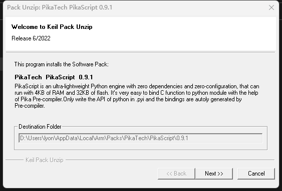
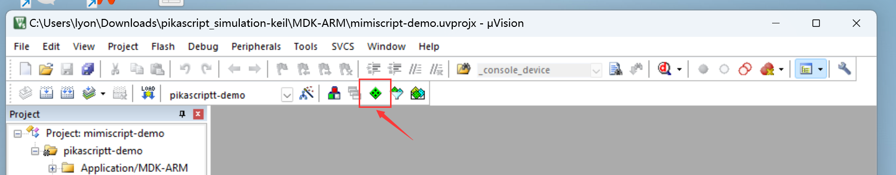
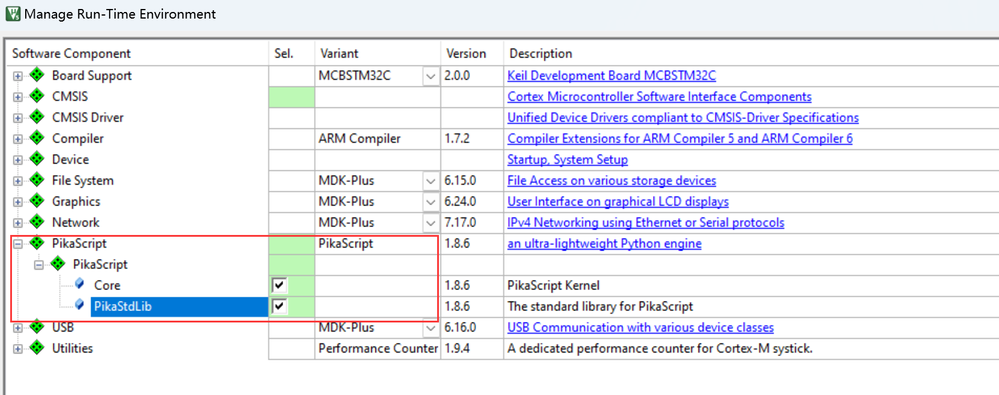
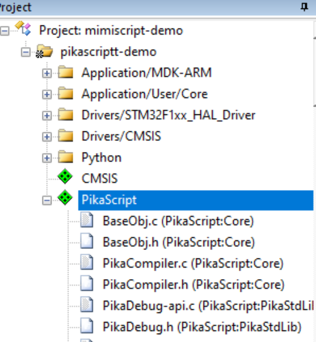
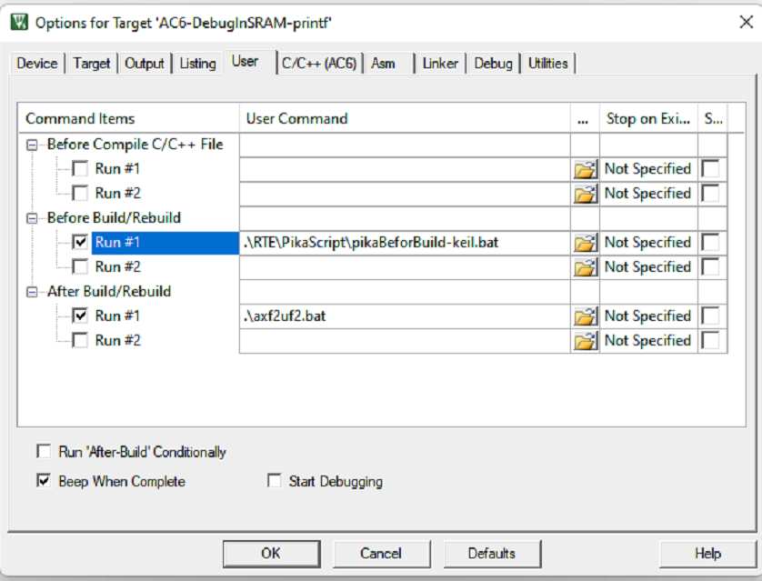
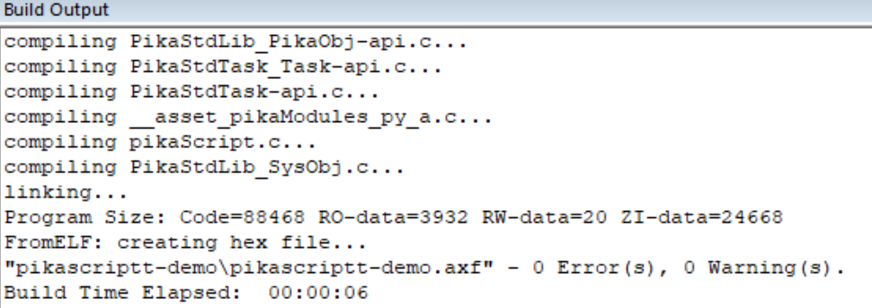
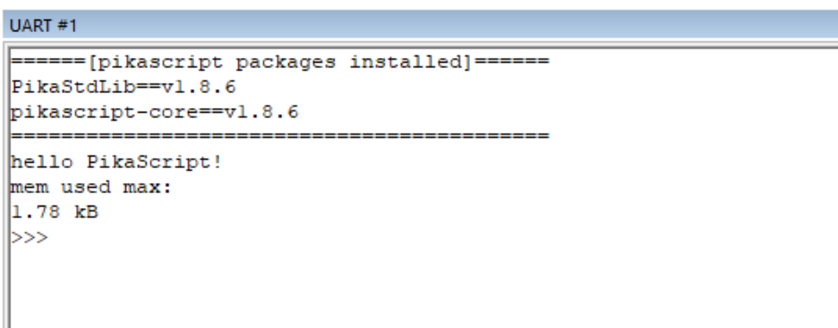

# Start with CMSIS-PACK

Users developing with Keil can use CMSIS-PACK to install PikaPython with one click.

## Install PikaTech.PikaPython.x.x.x.pack

[ Click to download ](https://gitee.com/Lyon1998/pikapython/attach_files/1615398/download)

Just go all the way to Next and install



## Set in the project



Check PikaPython, including Core and PikaStdLib



Here you can see that PikaPython has been added



In Before Build add

```
.\RTE\PikaPython\pikaBeforBuild-keil.bat
```



Then introduce in main.c

``` c
#include "pikaScript.h"
```

Start PikaPython after initializing the system and printf

``` c
PikaObj *pikaMain = pikaScriptInit();
```

Compile successfully.



Run successfully !



For more usage, please refer to [porting guide](index_porting.html)
