# Start with the LVGL GUI Simulation Project

The LVGL GUI Simulation Project provides an experimental environment for co-simulation of PikaScript and LVGL.

The GUI simulation can be performed on a PC using Visual Studio.

## Get the project

[http://pikascript.com/](http://pikascript.com/)

Select lvgl-vs-simu, a Visual Studio simulation project, from the Project Builder on the official PikaScript website.

This project is branched from the [official LVGL Visual Studio simulation project](https://github.com/lvgl/lv_port_win_visual_studio).

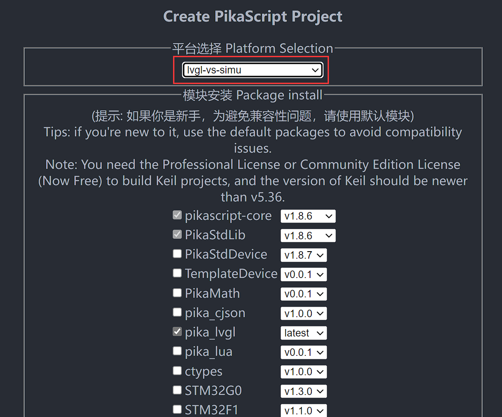

Click Generate Project and wait about 1 minute.

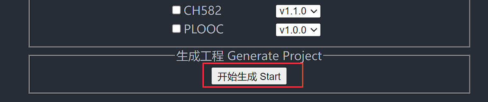

Unzip the project and open LVGL.Simulator.sln

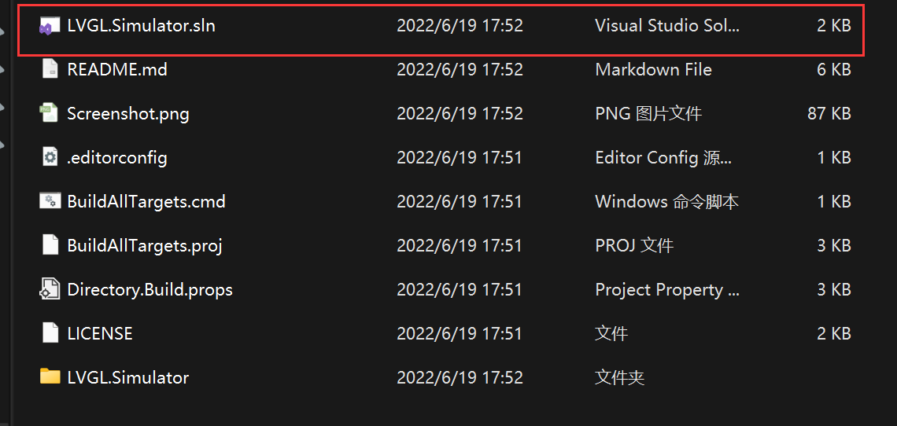

Start compiling and running directly

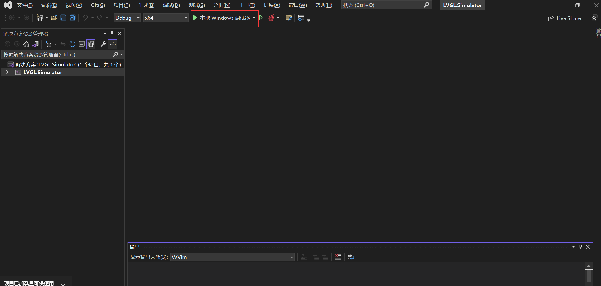

You can see that the lvgl emulator has been successfully started

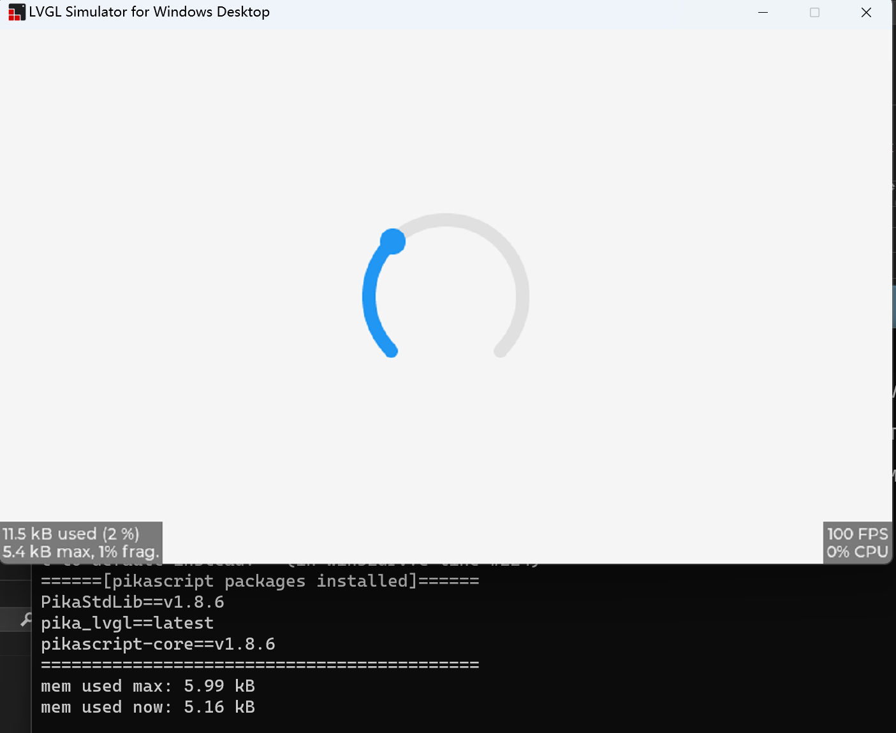

## Programming with Python

The Python file for running the project is in LVGL.Simulator/pikascript/main.py, and it is recommended to edit the Python file with VSCode.

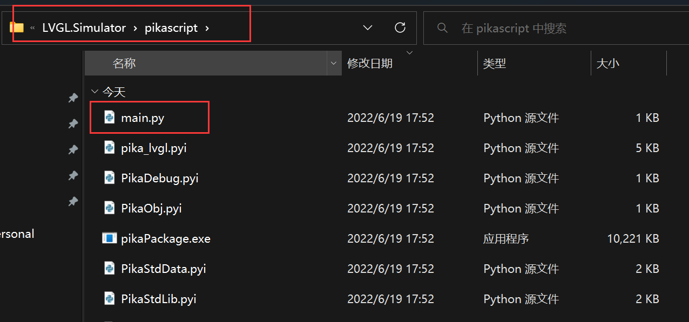

The code in main.py is shown below, and the project will run this main.py when it starts

```python
# main.py
import pika_lvgl as lv
import PikaStdLib
mem = PikaStdLib.MemChecker()

# Create an Arc
arc = lv.arc(lv.scr_act())
arc.set_end_angle(200)
arc.set_size(150, 150)
arc.center()

print('mem used max: %0.2f kB' % (mem.getMax()))
print('mem used now: %0.2f kB' % (mem.getNow()))
```

More sample code

You can see more sample code in the [/pikascript/examples/lvgl](https://github.com/pikastech/pikascript/tree/master/examples/lvgl) folder.

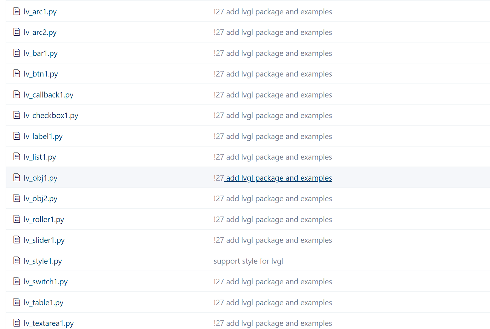

For example, you can copy lv_callback1.py into main.py.

```python
# lv_callback1.py
import pika_lvgl as lv
import PikaStdLib
mem = PikaStdLib.MemChecker()


def event_cb_1(evt):
    print('in evt1')
    print('mem used now: %0.2f kB' % (mem.getNow()))


def event_cb_2(evt):
    print('in evt2')
    print('mem used now: %0.2f kB' % (mem.getNow()))


btn1 = lv.btn(lv.scr_act())
btn1.align(lv.ALIGN.TOP_MID, 0, 10)
btn2 = lv.btn(lv.scr_act())
btn2.align(lv.ALIGN.TOP_MID, 0, 50)
btn1.add_event_cb(event_cb_1, lv.EVENT.CLICKED, 0)
btn2.add_event_cb(event_cb_2, lv.EVENT.CLICKED, 0)

print('mem used max: %0.2f kB' % (mem.getMax()))
print('mem used now: %0.2f kB' % (mem.getNow()))
```

After replacing main.py, run PikaScript's pre-compiler

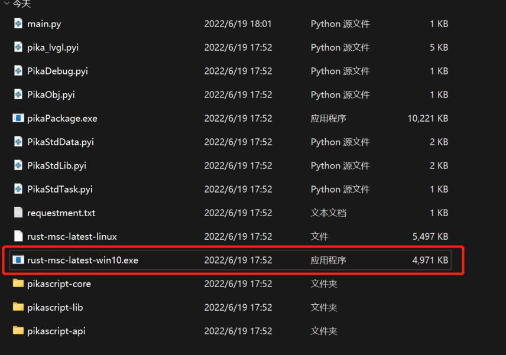

and then start running

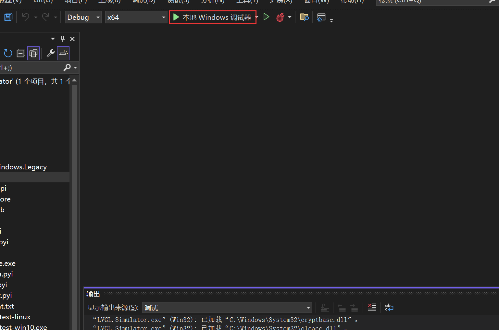

In this example you can click the button and then view the output.

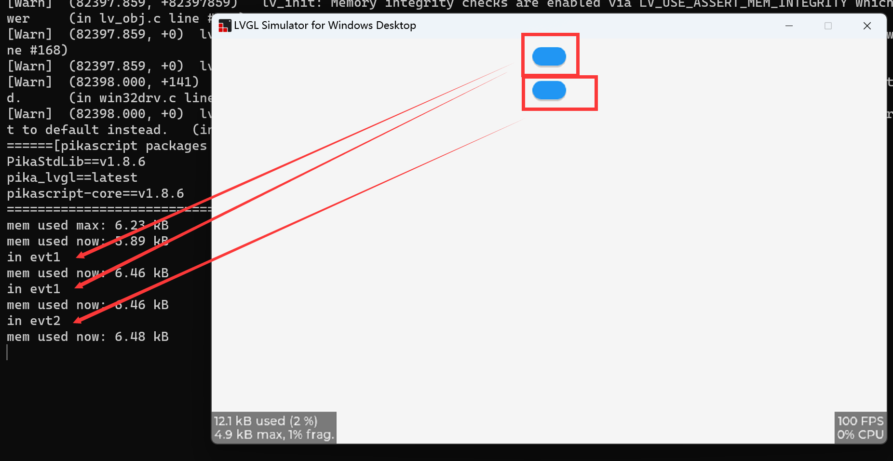

## Frequently Asked Questions

If you are prompted for missing functions, you need to manually add the files to be compiled

Right-click on pikascript/pikascript-api and pikascript/pikascript-lib and click "Include in project", then recompile.

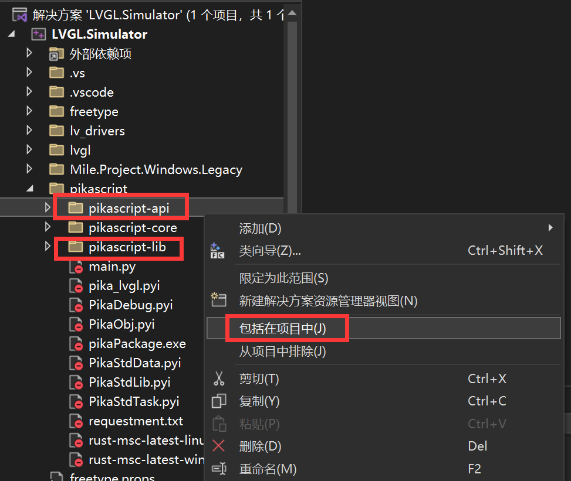
