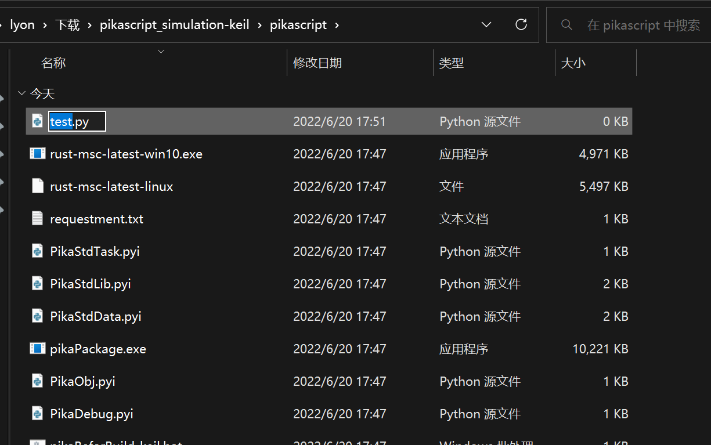
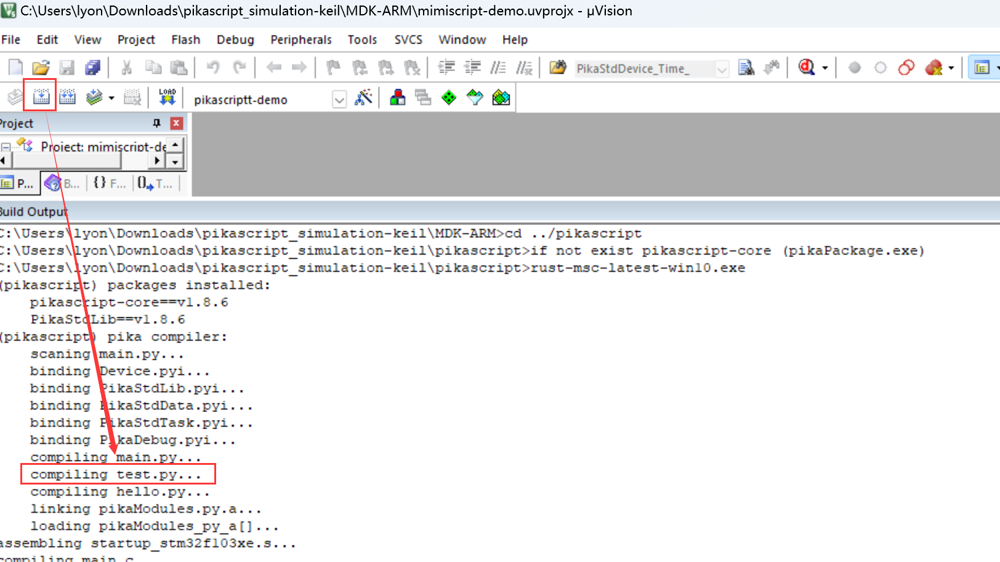
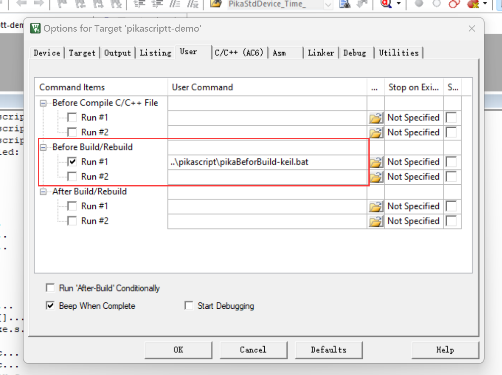
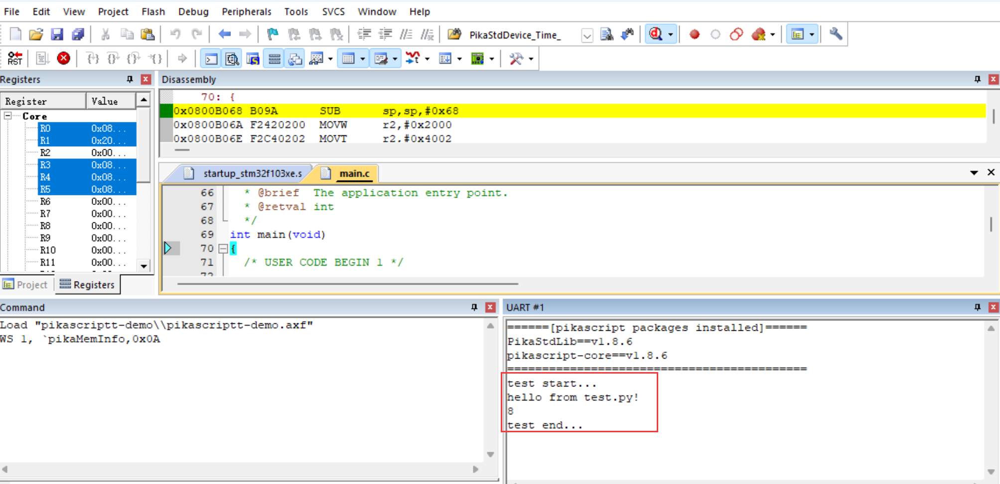
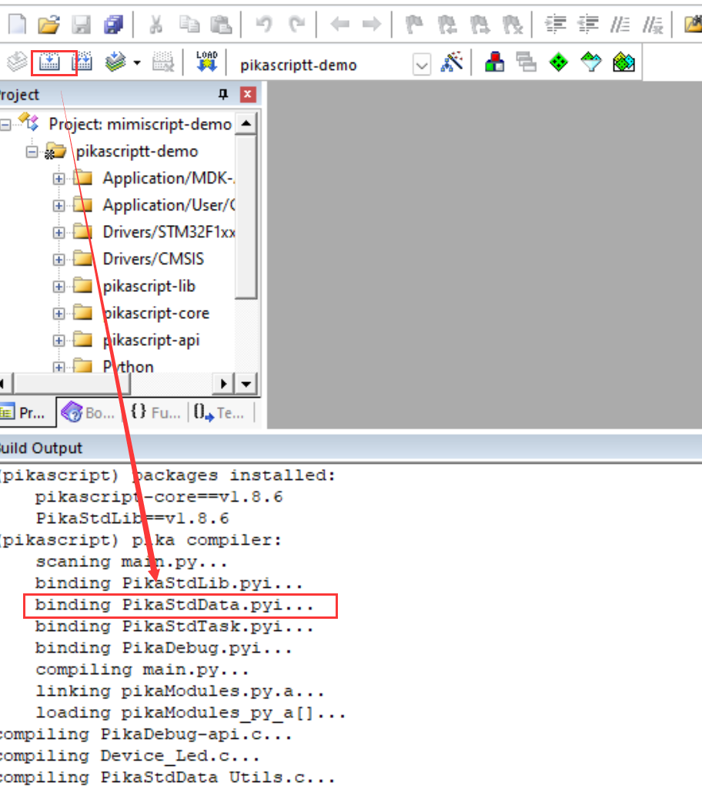
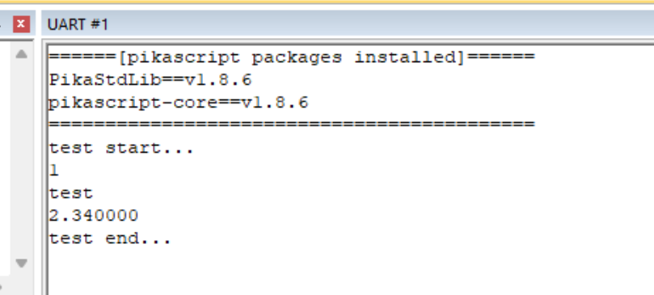

# Module Import

The embedded environment is significantly different from the PC, in many cases the MCU doesn't even have a file system.

But don't worry, PikaScript already helps you to import modules easily with its official tools, all you need to do is to write a line `import`, just like you do with Python on PC.

The only difference with Python for PC is that you need to run the pre-compiler provided by PikaScript once (no complicated parameters and options, just double-click to run) before you can compile your PikaScript project with the compiler.

## Importing Python modules

PikaScript supports importing multiple Python files as modules, and there is no need to port the filesystem inside the MCU (if you want to base it on a filesystem, you can, of course).

PikaScript's pre-compiler converts Python files into bytecode and packages them into a library right on the PC development machine, just like C.

This eliminates the need for a filesystem in a MCU with few resources (usually 20kB of ROM).

On the other hand, if you want to quickly try PikaScript on a new platform, you don't need to go through the effort of porting the filesystem for the new platform and then interfacing the filesystem with PikaScript.

(Note that a kernel version of not less than v1.8.0 is required)

### Experiment

We still use keil's emulation project as our experiment platform, so that we can experiment quickly without hardware.

First, refer to keil's [emulation project documentation](https://pikadoc.readthedocs.io/en/latest/Keil%20%E4%BB%BF%E7%9C%9F%E5%B7%A5%E7%A8%8B.html) to get the project.

Then create a new Python file test.py in the pikascript_simulation-keil/pikascript/ directory (all Python modules should be placed in this directory).



 Then write the test code inside test.py as follows

``` python
# test.py
def mytest():
    print('hello from test.py!')

def add(a, b):
    return a + b

```

Next, introduce test.py inside main.py and test the functions mytest() and add() that we defined in test.py

``` python
import Device
import PikaStdLib
import PikaStdData
import hello

import test

print('test start...')

test.mytest()
print(test.add(3, 5))

print('test end...')
```

Then, if you compile directly inside the keil project, you will see that the PikaScript Compiler message appears before you start compiling the .c file, including the compiled test.py.



This is because the PikaScript precompiler has been automatically run, a Keil-supplied setting that executes a script before compilation begins, including running the PikaScript precompiler.



Then we start debugging the run and open the serial window to see the results



If you are interested in the principle, you can watch the [explainer video](https://www.bilibili.com/video/BV14t4y1x7nv?spm_id_from=333.999.0.0).

## Importing C modules

A C module is a module that is implemented in C at the bottom, but can still be called with Python.

A C module named `<module>` usually consists of a `<module>.pyi` file (a python interface file) and the pikascript-lib/\<module\> folder.

PikaScript imports C modules in the same way as Python modules, by directly `importing` and then running a pre-compile.

After pre-compilation, some module linking files are automatically generated, all of them are in the pikascript-api folder. Therefore, after introducing the C module, you need to add the following files to the project for compilation.

- All .c files in the pikascript-lib/\<module\> folder
- All .c files in the pikascript-api folder

### Experiment

We are still using the keil emulation project as our experimentation platform.

We introduce the PikaStdData.pyi C module in main.py.

We open PikaStdData.pyi to see the classes and functions provided by this C module.

``` python
# PikaStdData.pyi
from PikaObj import *

class List(TinyObj):
    def __init__(self): ...
    # add an arg after the end of list
    def append(self, arg: any): ...
    # get an arg by the index
    def get(self, i: int) -> any: ...
    # set an arg by the index
    def set(self, i: int, arg: any): ...
    # get the length of list
    def len(self) -> int: ...
...
```

You can see that there is a `List` class inside.

Introduce `PikaStdData` in main.py and create a new object `list` with the `List` class, then test the `append()` method and the `get()` method of `List`.

``` python
import PikaStdLib

import PikaStdData

print('test start...')

list = PikaStdData.List()
list.append(1)
list.append('test')
list.append(2.34)

print(list.get(0))
print(list.get(1))
print(list.get(2))

print('test end...')
```

When compiling, you can see that the PikaScript pre-compiler binds the PikaStdData C module to the project.



Running the simulation you can see the result



You can also make your own C modules, all you need to do is write the \<module\>.pyi Python interface file and the .c implementation file inside pikascript-lib/\<module\>.

Please refer to the [documentation for making C modules](https://pikadoc.readthedocs.io/en/latest/index_cmodule.html) for details.
