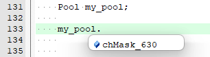
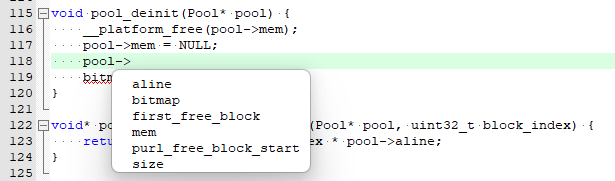

# How to contribute to the kernel

## Development Conventions

|                                           | Rule                           | Note        |
| ----------------------------------------- | ------------------------------ | ----------- |
| C Language Standard                       | C99 without GNU extensions     |             |
| Macros for constant value                 | Allowed                        |             |
| Function-like macros                      | Avoid in principle             |             |
| Macro Switches                            | Use with cautions              |             |
| Macro Splicing                            | Avoid in principle             |             |
| Naming rules for variables                | words separated by underscores | Linux Style |
| Naming rules for functions                | words separated by underscores | Linux Style |
| Naming rules for properties (for classes) | Small-Camel                    |             |

**Note**: For items listed as Avoid-in-principle, if they are really required, each use-case need to be discussed separately.

### Exceptions
- [PLOOC](https://github.com/GorgonMeducer/PLOOC) - The Protected Low-overhead Object Oriented Programming
- [__instruction_def.h](https://github.com/pikasTech/pikascript/blob/master/src/__instruction_def.h) - simplify the management of VM instructions in coding.


## Kernel development environment

### Option 1 Development under Linux (recommended)
## Test core in docker (recommend)
step1: Clone the repo
``` shell
git clone https://github.com/pikastech/pikascript
cd pikascript/docker 
```

step2: build and run the docker contianer
```
sh build.sh
sh run.sh
```

step3: init the port/linux
``` shell	
cd port/linux
sh pull-core.sh
sh init.sh
```

step4: test the core 
``` shell
sh gtest.sh
sh ci_benchmark.sh
```

step5: Run the REPL
``` shell
sh run.sh
```

### Scheme 2 pico real machine development
Prepare a copy of the Raspberry Pi pico development board, then clone the complete repository and use the bsp/pico-dev project in the repository.


## Object-Oriented Programming with ANSI-C

### Overview

PikaScript employs the popular **Object-Oriented Programming with ANSI-C**, a.ka. **OOPC** methodology in the design and uses an open-source OOPC template, i.e. [PLOOC](https://github.com/GorgonMeducer/PLOOC) in the kernel. In addition to the normal structure based class definition, PLOOC introduced a so-called masked-structures. With this trick, members of a class can not only be marked as **private**, **protected** and **public**, but also actually protected as ***private***/***protected*** as other native OO languages do, such as C++, C# etc. 

For example, in the `dataMemory.h`, it defines a class `Pool`:

```c
#if defined(__DATA_MEMORY_CLASS_IMPLEMENT__)
#define __PLOOC_CLASS_IMPLEMENT__
#elif defined(__DATA_MEMORY_CLASS_INHERIT__)
#define __PLOOC_CLASS_INHERIT__
#endif

#include "__pika_ooc.h"

...

dcl_class(Pool);

def_class(Pool, 
    private_member(
        BitMap bitmap;
        uint8_t* mem;
        uint8_t aline;
        uint32_t size;
        uint32_t first_free_block;
        uint32_t purl_free_block_start;
    )
);
```

Here, all members are embraced with `private_member()`, that means outside the class scope, people cannot see/access those private members, as shown below:

 

While, in the `dataMemory.h`, a macro `__DATA_MEMORY_CLASS_IMPLEMENT__` is added before any includings:

```c
#define __DATA_MEMORY_CLASS_IMPLEMENT__
#include "dataMemory.h"
#include "PikaPlatform.h"
...
```

hence, inside those method functions of the class `Pool`, we can see/access all members listed as private:

 

This is because macro `__DATA_MEMORY_CLASS_IMPLEMENT__` marks the whole `dataMemory.c` as it is inside the `Pool` class scope. 

### Visibility Control

PLOOC is a tool to force a visibility control in the c programming. There are plenty of ways to remove those visibility control in different scales, as shown in the **Table 3-1**:

**Table 3-1 Summary of visibility controls in PLOOC**

| Token (Macro)                              | Scope  | Usage                                                       | Description                                                  |
| ------------------------------------------ | ------ | ----------------------------------------------------------- | ------------------------------------------------------------ |
| **\_\_OOC_DEBUG\_\_**                      | Global | Define it in the project configuration                      | Disable protection for private and protected members. We only use this feature for debugging purpose. |
| **\_\_OOC_CPP\_\_**                        | Global | Define it in the project configuration                      | When you including PLOOC enabled header files in any CPP source files, please define this macro to avoid compilation errors. |
| **\_\_\<class_name\>_CLASS_IMPLEMENT\_\_** | Local  | Define it at the very beginning of the target c source file | It marks current c source file as if it is inside the scope of the target class. You can access all class members. |
| **\_\_\<class_name\>_CLASS_INHERIT\_\_**   | Local  | Define it at the very beginning of the target c source file | It marks current c source file as if it is inside the scope of a derived class of the target class (base class). You can access the protected and public members of the base class. |

NOTE: Please use these Tokens carefully and following the OO design principles. 

### Rules of using PLOOC inside PikaScript

- We only use PLOOC inside kernel in principle 
- Contributors are **NOT** forced to use PLOOC even contribute to the kernel. 
  - Unless otherwise state, we assume that you agree that the maintainer are authorized to modify your code for adding PLOOC. 
